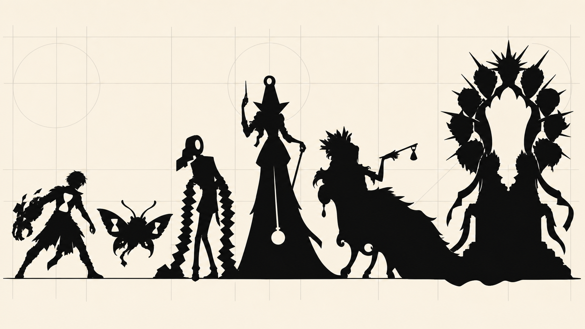

# Silhouette Sprint 01

Дата: 27 августа 2026  
Формат: строгая проверка чёрных силуэтов без цвета и костюмного рендера

## Порядок слева направо

1. **Ноль** — главный герой: асимметричная рука-съёмник и пустота-песочные часы в груди.
2. **Молец Завтра** — небольшой парящий талисман с песочными часами в крыльях.
3. **Талонник** — голова-рулон и две длинные гармошечные руки.
4. **Сборщица Пени** — высокая фигура-метроном с отвесом-маятником.
5. **Госпожа Отложенность** — медленная лежащая S-форма, тело-предмет роскоши.
6. **Календарх** — босс с пустым центром и венцом из двенадцати месячных масок.

## Первичная оценка

### Что уже работает

- Все шесть ролей узнаются без цвета, лица и мелких деталей.
- Масштаб создаёт понятную иерархию: талисман, герой, рядовой враг, элита, владелец и босс.
- У каждого персонажа есть один сильный первичный знак.
- Отсутствует прямое сходство с цифровыми часами на предплечье из фильма «Время».
- Формы основаны на игровом поведении: гармошка, маятник, ожидание, круг двенадцати фаз.

### Что проверить следующей итерацией

- Рука Ноля может стать слишком монструозной и забрать внимание у песочных часов в груди. Нужны три варианта пропорции перчатки.
- Молец хорошо читается, но нужно проверить его в реальном маленьком размере интерфейса.
- Круглая голова Талонника пока может восприниматься как обычные часы. Нужно усилить вид отрывного рулона и бумажный хвост.
- Сборщица Пени имеет сильный общий контур, но плечи и головной знак пока недостаточно уникальны. Следующая версия должна сделать «начисление процентов» частью верхнего силуэта.
- Госпожа Отложенность и Календарх занимают большую горизонтальную площадь; это важно учесть при выборе игровой камеры и расположении UI.
- Венец Календарха должен анимироваться по месяцам без превращения в визуальный шум.

## Решение

Лист считается успешным как первая проверка направления. В следующий проход стоит не перерисовывать всех сразу, а сделать отдельные вариативные листы:

1. Ноль — 6 вариантов руки и позы.
2. Талонник — 6 вариантов рулона, бумажного хвоста и гармошечных рук.
3. Сборщица Пени — 6 вариантов верхнего силуэта и маятника.

Молец Завтра, Госпожа Отложенность и Календарх пока могут служить стабильными опорными формами ростера.

